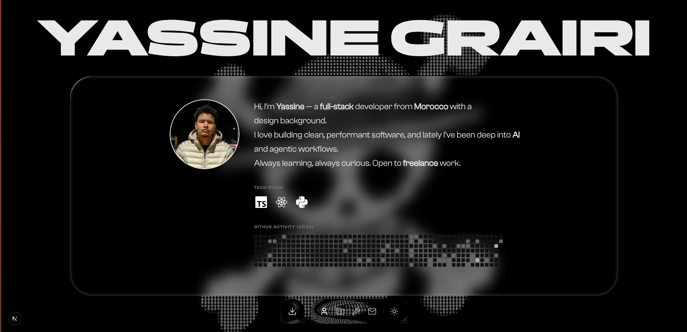
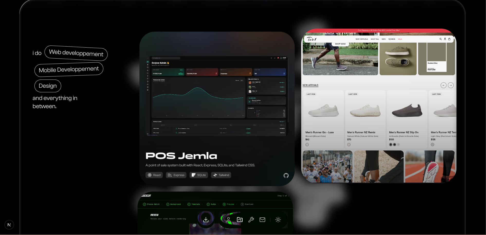
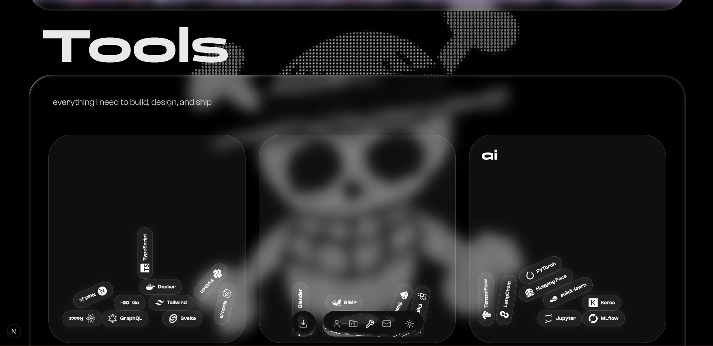
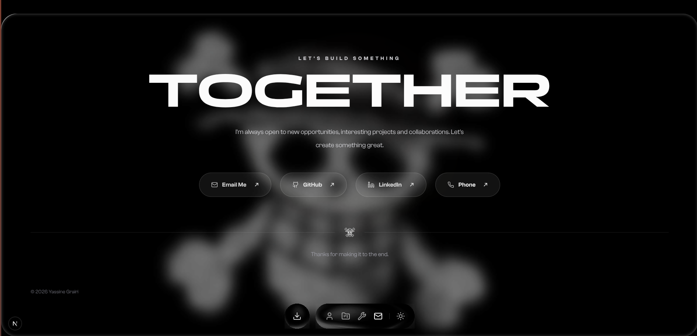

# Portfolio-v1

> **Personal Portfolio — Full-Stack Developer & Designer**

[](https://nextjs.org/)
[](https://reactjs.org/)
[](https://www.typescriptlang.org/)
[](https://tailwindcss.com/)
[](https://gsap.com/)
[](https://www.framer.com/motion/)
[](https://lenis.studiofreight.com/)
[](https://brm.io/matter-js/)
[](https://vitest.dev/)

---

## Screenshots

| About / Hero (Light)                                  | About / Hero (Dark)                                 |
| ----------------------------------------------------- | --------------------------------------------------- |
|                  | *(dark variant available)*                          |

| Projects                                              | Tools                                                  |
| ----------------------------------------------------- | ------------------------------------------------------ |
|                  |                         |

| Contact                                               |
| ----------------------------------------------------- |
|                    |

---

## The Story

This portfolio was built to showcase projects, tools, and design sensibility in a way that feels **interactive and memorable** — not just another list of links.

Every section is crafted with attention to motion and detail:

- The **hero** introduces who I am with a liquid-glass card, a live tech-stack carousel, and GitHub commit heatmap
- **Projects** highlights featured work with magnetic hover cards
- **Tools** visualises my toolset in a physics sandbox — drag pills around, bump into neighbours, watch labels appear as you explore
- The full experience supports **dark/light mode**, smooth **Lenis scrolling**, and custom **GSAP scroll-triggered animations**

---

## Features

### Interactive Physics Sandbox (Tools section)

- Drag-and-drop tool pills powered by **Matter.js** — real collision, gravity, friction
- Hover over tool categories (dev / design / AI) to reveal labels
- Responsive: physics playground on desktop, static layout on mobile/tablet
- Dark/light mode-aware styling

### Liquid Glass Cards

- Custom glassmorphism component used across all sections
- Adaptive to dark/light themes with dynamic blur and border opacity

### Magnetic Project Cards

- Each project card follows the cursor with a subtle magnetic pull (desktop only)
- Fetches project metadata from local JSON files

### Smooth Scrolling

- Powered by **Lenis** for butter-smooth scroll with GSAP ScrollTrigger integration
- Custom easing and scroll-driven animations on hero, project titles, and tool labels

### Dark/Light Mode

- System-aware with `prefers-color-scheme` detection at load time (no flash)
- No toggle — follows OS preference seamlessly

### Custom Fonts

- Three distinct typefaces loaded locally: **Expose** (display), **Clash Grotesk** (body), **Panchang** (headings)
- No external font requests — fully self-hosted

### GitHub Integration

- Live contribution calendar via `react-activity-calendar`
- Public activity data fetched from GitHub API

---

## Tech Stack

| Layer             | Tech                                                                      |
| ----------------- | ------------------------------------------------------------------------- |
| **Framework**     | Next.js 16 (App Router)                                                   |
| **UI Library**    | React 19, TypeScript 5                                                    |
| **Styling**       | Tailwind CSS 4, `tailwindcss-animate`, `clsx`, `tailwind-merge`           |
| **Animation**     | GSAP 3 (with ScrollTrigger, `@gsap/react`), Framer Motion 12, Lenis 1     |
| **Physics**       | Matter.js 0.20, `poly-decomp`                                             |
| **Icons**         | Lucide React, Simple Icons (via CDN)                                      |
| **Commits**       | `react-activity-calendar`                                                 |
| **Testing**       | Vitest 4, Testing Library (jest-dom, react), jsdom                        |
| **Tooling**       | ESLint 9, `eslint-config-next`                                            |
| **Fonts**         | Expose, Clash Grotesk, Panchang (self-hosted via `next/font/local`)       |

---

## Getting Started

### Prerequisites

- **Node.js** 20+ installed

### Installation

```bash
# 1. Clone the repository
git clone https://github.com/yass-gr/portfolio-v1.git
cd portfolio-v1

# 2. Install dependencies
npm install

# 3. Start the development server
npm run dev
```

Open [http://localhost:3000](http://localhost:3000) in your browser.

### Build for Production

```bash
npm run build
npm start
```

---

## Project Structure

```
├── app/                    # Next.js App Router
│   ├── layout.tsx          # Root layout (fonts, providers, metadata)
│   ├── page.tsx            # Home page (Hero → Projects → Tools)
│   ├── fonts.ts            # Local font configuration
│   └── globals.css         # Global styles + Tailwind
├── sections/               # Page sections
│   ├── Hero.tsx            # About section with glass card, avatar, carousel
│   ├── Projects.tsx        # Project showcase with magnetic cards
│   └── tools.tsx           # Interactive physics sandbox (tools)
├── components/             # Reusable components
│   ├── LiquidGlassCard.tsx # Glassmorphism card wrapper
│   ├── GlassSurface.tsx    # Glass surface effect
│   ├── gravity.tsx         # Matter.js gravity wrapper
│   ├── magnet.tsx          # Magnetic cursor effect wrapper
│   ├── projectCard.tsx     # Project card with image & details
│   ├── Avatar.tsx          # Profile avatar component
│   ├── logo-carousel.tsx   # Animated tech logo marquee
│   ├── GitHubCommits.tsx   # GitHub activity calendar
│   ├── BottomNav.tsx       # Fixed bottom navigation
│   ├── download-cv.tsx     # CV download button
│   ├── footer.tsx          # Page footer
│   ├── preloader.tsx       # Entry animation preloader
│   ├── lenis-provider.tsx  # Lenis scroll provider
│   ├── tooltip.tsx         # Radix tooltip wrapper
│   └── inline-script.tsx   # Inline script injection component
├── public/                 # Static assets
│   ├── fonts/              # Self-hosted fonts (Expose, Clash Grotesk, Panchang)
│   ├── projects/           # Project metadata & images
│   │   ├── pos-Jemla/
│   │   ├── quickcut/
│   │   └── running-ecom/
│   ├── avatar.jpeg
│   ├── strawhat.png
│   └── background-*.webm   # Animated background videos
├── screenshots/            # README screenshots
├── vitest.config.ts        # Vitest configuration
├── tailwind.config.ts      # Tailwind CSS configuration
└── package.json
```

---

## Featured Projects

| Project                                                                    | Stack                            |
| -------------------------------------------------------------------------- | -------------------------------- |
| **[POS Jemla](https://github.com/yass-gr/Jemla-POS)**                     | React, Express, SQLite, Tailwind |
| Point of Sale & Business Management for wholesale fruit & vegetable distribution |                                  |
| **[QuickCut](https://github.com/yass-gr/quickCut)**                       | Next.js, Remotion, ffmpeg        |
| Football video generator for TikTok & Reels with wizard-based workflow     |                                  |
| **[Tor1 Shoes](https://github.com/G13Q/Running)**                         | PHP, MySQL, jQuery               |
| Full-featured shoes e-commerce with admin panel                           |                                  |

---

## Performance & Optimisation

- **Self-hosted fonts** — zero external requests for typography
- **Next.js App Router** — automatic code splitting, RSC streaming
- **Lazy-loaded Matter.js** — physics engine only initialises when the Tools section scrolls into view
- **Video backgrounds** — optimised WebM format with `prefers-color-scheme` switching
- **SVG icons** — Lucide React tree-shakeable icons, Simple Icons loaded from CDN with fallbacks

---

## License

MIT
